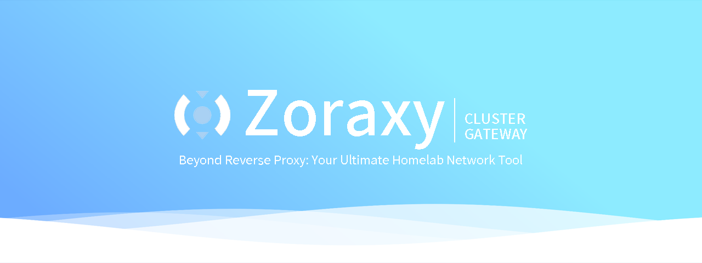

# Zoraxy

General purpose request (reverse) proxy and forwarding tool for low power devices. Now written in Go!

### Features

- Simple to use interface with detail in-system instructions

- Reverse Proxy
  
  - Subdomain Reverse Proxy
  
  - Virtual Directory Reverse Proxy

- Redirection Rules

- TLS / SSL setup and deploy

- Blacklist by country or IP address (single IP, CIDR or wildcard for beginners :D) 

- (More features work in progress)

## Usage

Zoraxy provide basic authentication system for standalone mode. To use it in standalone mode, follow the instruction below for your desired deployment platform.

### Standalone Mode

Standalone mode is the default mode for Zoraxy. This allow single account to manage your reverse proxy server just like a home router. This mode is suitable for new owners for homelab or makers start growing their web services into multiple servers.

#### Linux

```bash
//Download the latest zoraxy binary and web.tar.gz from the Release page
sudo chmod 775 ./zoraxy web.tar.gz
sudo ./zoraxy -port=:8000
```

#### Windows

Download the binary executable and web.tar.gz, put them into the same folder and double click the binary file to start it.

#### Raspberry Pi

The installation method is same as Linux. If you are using Raspberry Pi 4 or newer models, pick the arm64 release. For older version of Pis, use the arm (armv6) version instead.

#### Other ARM SBCs or Android phone with Termux

The installation method is same as Linux. For other ARM SBCs, please refer to your SBC's CPU architecture and pick the one that is suitable for your device. 

### External Permission Managment Mode

If you already have a up-stream reverse proxy server in place with permission management, you can use Zoraxy in noauth mode. To enable no-auth mode, start Zoraxy with the following flag

```bash
./zoraxy -noauth=true
```

*Note: For security reaons, you should only enable no-auth if you are running Zoraxy in a trusted environment or with another authentication management proxy in front.*

#### Use with ArozOS

[ArozOS ](https://arozos.com)subservice is a build in permission managed reverse proxy server. To use zoraxy with arozos, connect to your arozos host via ssh and use the following command to install zoraxy

```bash
# cd into your arozos subservice folder. Sometime it is under ~/arozos/src/subservice
cd ~/arozos/subservices
mkdir zoraxy
cd ./zoraxy

# Download the release binary from Github release
wget {binary executable link from release page}
wget {web.tar.gz link from release page}

# Set permission. Change this if required
sudo chmod 775 -R ./ 

# Start zoraxy to see if the downloaded arch is correct. If yes, you should
# see it start unzipping
./zoraxy

# After the unzip done, press Ctrl + C to kill it
# Rename it to valid arozos subservice binary format
mv ./zoraxy zoraxy_linux_amd64

# If you are using SBCs with different CPU arch
mv ./zoraxy zoraxy_linux_arm
mv ./zoraxy zoraxy_linux_arm64

# Restart arozos
sudo systemctl restart arozos
```

To start the module, go to System Settings > Modules > Subservice and enable it in the menu. You should be able to see a new module named "Zoraxy" pop up in the start menu.

## Build from Source

*Requirement: Go 1.17 or above*

```bash
git clone https://github.com/tobychui/zoraxy
cd ./zoraxy/src
go mod tidy
go build

./zoraxy
```

### Forward Modes

#### Proxy Modes

There are two mode in the ReverseProxy Subservice

1. vdir mode (Virtual Dirctories)
2. subd mode (Subdomain Proxying Mode)

Vdir mode proxy web request based on the virtual directories given in the request URL. For example, when configured to redirect /example to example.com, any visits to {your_domain}/example will be proxied to example.com.

Subd mode proxy web request based on sub-domain exists in the request URL. For example, when configured to redirect example.localhost to example.com, any visits that includes example.localhost (e.g. example.localhost/page1) will be proxied to example.com (e.g. example.com/page1)

#### Root Proxy

Root proxy is the main proxy destination where if all proxy root name did not match, the request will be proxied to this request. If you are working with ArozOS system in default configuration, you can set this to localhost:8080 for any unknown request to be handled by the host ArozOS system

## License

To be decided (Currently: All Right Reserved)
